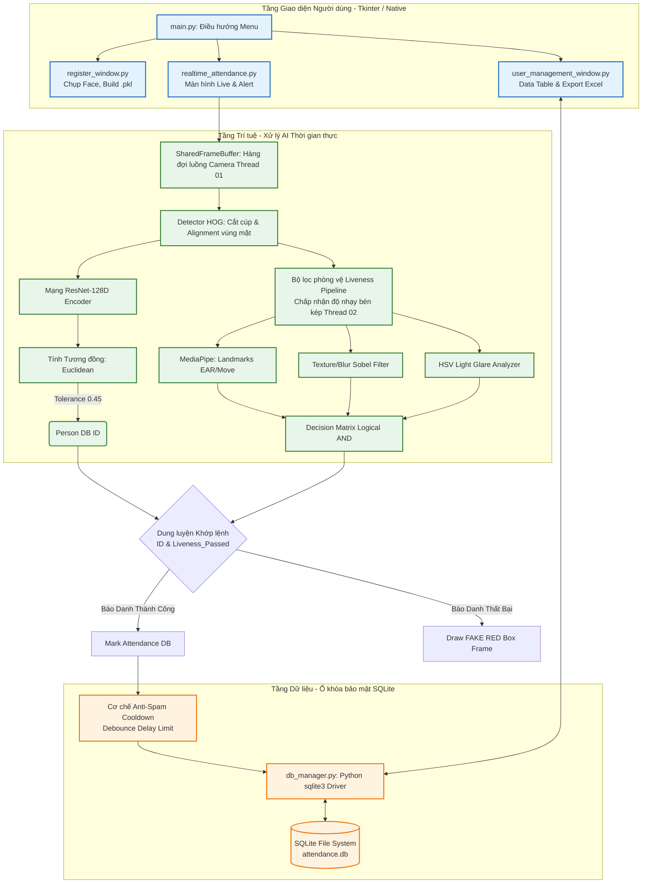
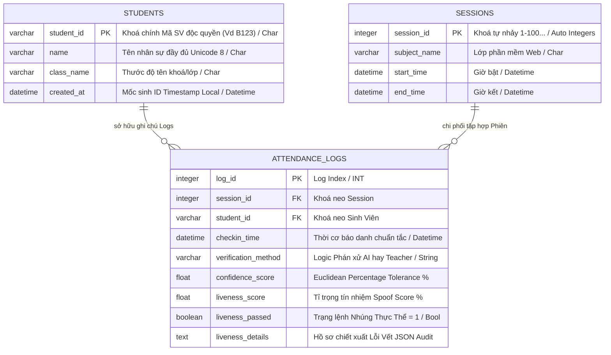

# BÁO CÁO ĐỒ ÁN MÔN HỌC
## Đề tài: Hệ thống điểm danh tự động bằng nhận diện khuôn mặt kết hợp phòng chống giả mạo tiên tiến (Advanced Anti-Spoofing Liveness Detection)

---

## MỤC LỤC
1. [Mở đầu](#1-mở-đầu)
   1.1. Bối cảnh và lý do chọn đề tài
   1.2. Mục tiêu nghiên cứu và ứng dụng
   1.3. Phạm vi và đối tượng ứng dụng
   1.4. Đóng góp của đề tài
2. [Cơ sở lý thuyết và Thuật toán](#2-cơ-sở-lý-thuyết-và-thuật-toán)
   2.1. Thị giác máy tính và Nhận diện khuôn mặt (Face Recognition)
     2.1.1. Phát hiện khuôn mặt bằng thuật toán HOG (Histogram of Oriented Gradients)
     2.1.2. Trích xuất đặc trưng với Deep Metric Learning (Mạng ResNet)
     2.1.3. Đo lường khoảng cách và Độ tương đồng (Euclidean Distance & Cosine Similarity)
   2.2. Kỹ thuật đánh giá sự sống và chống giả mạo (Liveness Detection)
     2.2.1. MediaPipe Face Mesh và Thuật toán đo lường chớp mắt EAR
     2.2.2. Phân tích kết cấu da bằng Đạo hàm Sobel (Texture Analysis)
     2.2.3. Đánh giá chất lượng hội tụ bằng Toán tử Laplacian (Blur Analysis)
     2.2.4. Phát hiện màn hình phản quang qua Không gian màu HSV
3. [Thiết kế và Cấu trúc Hệ thống](#3-thiết-kế-và-cấu-trúc-hệ-thống)
   3.1. Phân tầng kiến trúc hệ thống (Architecture Diagram)
   3.2. Lưu đồ giải thuật điểm danh thời gian thực (Real-time Flowchart)
   3.3. Tối ưu hóa hiệu năng tính toán đa luồng (Double-threading)
   3.4. Mô hình Cơ sở dữ liệu và Cơ chế Cooldown
4. [Kết quả thực nghiệm](#4-kết-quả-thực-nghiệm)
   4.1. Môi trường triển khai
   4.2. Giao diện và Chức năng (Screenshots)
   4.3. Đánh giá kiểm thử qua Kịch bản (Test Cases)
   4.4. Thống kê hiệu năng và độ nhạy hệ thống (TAR, TRR, FPS)
5. [Kết luận & Hướng phát triển](#5-kết-luận--hướng-phát-triển)

---

## 1. Mở đầu

### 1.1. Bối cảnh và lý do chọn đề tài
Trong kỷ nguyên công nghiệp 4.0 và quá trình chuyển đổi số đang diễn ra mạnh mẽ tại các cơ sở giáo dục, khối doanh nghiệp, việc tự động hóa các thủ tục hành chính lặp đi lặp lại nhằm tối ưu hóa nguồn lực con người là vô cùng quan trọng. Tại các trường trung cấp, cao đẳng và đại học, giảng viên thường phải đối mặt với các lớp học có sĩ số đông (từ 50 đến hơn 100 sinh viên). Việc điểm danh theo cách gọi tên truyền thống tốn kém từ 10 đến 15 phút, gây lãng phí ít nhất 15-20% thời lượng của một tiết học chuẩn. 

Ứng dụng thẻ từ RFID hay quét vân tay tuy có phần cải thiện tốc độ nhưng lại bộc lộ nhiều kẽ hở nghiêm trọng: sinh viên dễ dàng đưa thẻ cho bạn bè để "quẹt thẻ hộ", "điểm danh giùm"; thiết bị đọc vân tay bị giảm tuổi thọ nhanh chóng, thường xuyên không nhận diện được khi tay người dùng bị ướt, khô ráp hoặc bám bụi. Ngoài ra, trong bối cảnh các yêu cầu về vệ sinh dịch tễ được nâng cao (sau đại dịch COVID-19), thiết bị dùng chung (chạm vật lý) không còn là một giải pháp tối ưu.

Thị giác máy tính (Computer Vision), cụ thể là mô hình Nhận diện khuôn mặt (Face Recognition), nổi lên như một công cụ sinh trắc học phi tiếp xúc ưu việt. Khuôn mặt mỗi người là một định danh duy nhất (Identity). Sự tiện lợi thể hiện ở việc người dùng không phải mang theo bất cứ thiết bị ngoại vi nào, chỉ cần lộ mặt trước camera, tự động hóa sẽ đo lường và làm nốt phần còn lại. 

Dù vậy, một bài toán gai góc mới lại nảy sinh: Lỗ hổng Spoofing (Tấn công giả mạo Presentation Attack). Kẻ gian lận có thể in ảnh chất lượng cao lên giấy (Print Attack), đưa hình ảnh/video của bạn bè qua màn hình thiết bị di động (Replay Attack) đặt trước camera để lừa hệ thống. Một hệ thống nhận diện khuôn mặt dù thông minh đến mấy nhưng bỏ qua lớp phòng thủ Liveness Detection (Phát hiện thực thể sống) thì hoàn toàn vô giá trị trong thực tiễn quản lý bảo mật.

Chính vì lý do đó, dự án **"Hệ thống điểm danh tự động bằng nhận diện khuôn mặt kết hợp phòng chống giả mạo tiên tiến"** được chọn làm đề tài nghiên cứu và phát triển để giải quyết triệt để nút thắt ứng dụng nói trên.

### 1.2. Mục tiêu nghiên cứu và ứng dụng
Nghiên cứu được thiết lập nhằm xây dựng một quy trình trọn vẹn từ thu thập mẫu sinh trắc đến phân giải dữ liệu. Cụ thể:
1. **Xác thực danh tính (Face Verification):** Phân tích ảnh đầu vào, mã hóa khuôn mặt thành luồng vector kích thước 128 chiều và so khớp với toàn bộ cơ sở dữ liệu để tìm ra mã số sinh viên một cách nhanh chóng (độ chính xác > 95%).
2. **Ngăn chặn giả mạo (Anti-Spoofing):** Xây dựng hệ module Liveness Detection bằng phương pháp phân tích ảnh (Rule-based Texture Analysis) xen lẫn toán học hình học khuôn mặt, giúp tách biệt đối tượng người thật và lớp vật lý 2D, màn hình huỳnh quang từ chối các hình thức điểm danh gian lận.
3. **Phần mềm đồng bộ thân thiện:** Xây dựng phần mềm trên ngôn ngữ Python với giao diện điều khiển Tkinter hiện đại. Bao trọn chu trình thao tác đăng ký nhân sự quản lý cơ sở dữ liệu xuất báo cáo dạng bảng tính (Excel) phục vụ công tác thanh tra.
4. **Tối ưu phần cứng sẵn có:** Hệ thống được tinh chỉnh để chạy mượt mà ngay trên sức mạnh của CPU (Central Processing Unit) cơ bản thế hệ cũ thông qua thuật toán cắt giảm frame (frame-skipping) và đa luồng (threading). Không yêu cầu trang bị GPU (Card đồ họa) cấu hình khủng hay Camera 3D độ sâu hồng ngoại đắt tiền từ Mỹ/Châu Âu.

### 1.3. Phạm vi và đối tượng ứng dụng
- **Phạm vi triển khai:** Các môi trường máy chủ nội bộ (Local/Offline Desktop App) trên Windows, Linux, MacOS.
- **Đối tượng:** Sinh viên trong lớp học, nhân sự trong doanh nghiệp nhỏ và vừa (SME). Phù hợp nhất với môi trường có điều kiện ánh sáng văn phòng tương đối tốt và mức độ luân chuyển ra vào cửa nằm trong tần suất điều độ.

---

## 2. Cơ sở lý thuyết và Thuật toán

Dự án này là một sự giao thoa tổng hợp từ những phát minh lớn về Computer Vision thế kỷ 21. Sự phối hợp mượt mà giữa các thành phần toán học và Machine learning tạo nên một mạng lưới khép kín hoàn mỹ.

### 2.1. Thị giác máy tính và Nhận diện khuôn mặt (Face Recognition)
Hệ thống xử lý bài toán định danh qua 3 giai đoạn: Khoanh vùng vị trí $\rightarrow$ Đặc trưng hóa $\rightarrow$ So khớp khoảng cách.

#### 2.1.1. Phát hiện khuôn mặt bằng thuật toán HOG (Histogram of Oriented Gradients)
Trước tiên, thuật toán cần tách khuôn mặt người ra khỏi phần ngoại cảnh dư thừa trong khung video rườm rà (thường chiếm >80% diện tích ảnh vô nghĩa). 

*Hàm HOG (Dalal & Triggs, 2005)* làm việc bằng cách "đếm" khuynh hướng độ dốc của ánh sáng tại các pixel đứng cạnh nhau thay vì nhìn vào màu sắc chói lọi của bức ảnh:
1. Bức ảnh RGB được mã hóa về ảnh thang độ xám (Gray-scale 2D-matrix).
2. Duyệt qua từng ô nhỏ kích thước $8\times8$ pixel. Tại mỗi pixel, thuật toán khảo sát điểm ảnh biên trên, dưới, trái, phải để tính toán độ dốc (Gradient magnitude) và định hướng góc dốc (Orientation) sáng tối như thế nào.
3. Tạo ra các cung phân bố (Histogram of 9 bins) thể hiện hướng gradient chiếm đa số. Khi tổng hợp các cell nhỏ này lại toàn hình, nó làm nổi bật sắc nét vô cùng rõ nét dải viền ngoài khung mặt: Hốc mắt tối, sống mũi sáng và viền quai hàm. 
4. Các vector dữ liệu HOG trên sẽ được đẩy qua Mạng Không gian vector hỗ trợ (SVM Classifier) máy đã huấn luyện hàng triệu bức ảnh thật để xuất ranh giới tọa độ (Top, Right, Bottom, Left) Bounding Box quanh mặt. HOG tốn ít bộ nhớ lý thuyết, bù lại tốc độ CPU phi mã.

#### 2.1.2. Trích xuất đặc trưng với Deep Metric Learning (Mạng ResNet)
Một khung mặt sau khi cắt (crop) cần điều chỉnh mắt mũi nằm ngang hàng (Face Alignment) sau đó đi qua mô hình mạng Nơ-ron tích chập tàn dư sâu (Deep Residual Network - ResNet chuẩn dlib 29 conv layers).

Mô hình không dùng để phân loại (đây có phải Nguyễn Văn A?), mà dùng kiến trúc **Deep Metric Learning** với hàm lỗi **Triplet Loss**. Ý tưởng Triplet Loss đưa vào 3 bức ảnh cùng lúc trong quá trình huấn luyện máy:
- Dữ liệu neo ($Anchor, a$): Bức ảnh khuôn mặt gốc của người $X$.
- Dữ liệu dương ($Positive, p$): Một bức ảnh góc khác, biểu cảm khác của người $X$.
- Dữ liệu âm ($Negative, n$): Khuôn mặt người $Y$ hoàn toàn ngẫu nhiên.

Hàm mất mát Triplet được thiết kế để ép sao cho: $Distance(a, p) + alpha < Distance(a, n)$. Mạng nơ ron tự căn chỉnh trọng số sao cho biến bức ảnh khuôn mặt thành luồng số nhúng (**128-D Vector Embeddings**) đặc trưng duy nhất. 
Dù X đội nón, già đi, vector 128 số của X vẫn tự dồn tóm tụm lại một cụm trong không gian 128 chiều, rạch ròi phân cực cách xa khỏi nhóm vector đại diện của Y và Z. Nhờ đó, với 128 số float, hệ thống chứa hàng chục vạn danh tính mà file mã hóa database `.pkl` chỉ nặng vài trăm KB siêu bảo mật (vì không tốn công lưu ảnh 2D, và hacker không thể dò ngược từ 128 số để ra tấm ảnh thật ban đầu).

#### 2.1.3. Đo lường khoảng cách và Độ tương đồng (Euclidean Distance & Cosine Similarity)
Trong bước xác thực (Verification) tức thời khi đưa mặt vào camera: Hệ thống truy vấn 1 vector camera hiện tại gọi là $E_1$ (Encoding 1), đem so với ma trận n mẫu $E_{DB}$ dưới CSDL. 

Thuật toán hình học khoảng cách Euclid ($L_2$ Norm) đối kháng không gian $n$-chiều được đánh thức:
$$ d(E_1, E_{DB}) = \sqrt{\sum_{i=1}^{128}\left( E_1(i) - E_{DB}(i) \right)^2} $$

Biến $d$ trả về nằm trong hệ số $\in [0, \sim 1.5]$. Khoảng cách càng ngắn, hai khuôn mặt khả năng càng trùng khớp cao. 
Hệ thống thiết lập một ngưỡng dung sai (**Tolerance Threshold = 0.45**). 
- Nếu $d \leq 0.45$ $\rightarrow$ Báo Matching $True$, đồng thời sinh điểm số "Niềm Tin" $Confidence Score = (1 - d)$. Dĩ nhiên $d=0$ là trùng khớp hoàn hảo tuyệt đối (chỉ khi soi lại bức ảnh cũ xì đăng kí trước đó).
- Ngược lại $d > 0.45$ $\rightarrow$ Rơi ra khỏi miền dung sai: Từ chối kết nạp, gắn cờ Unknown (Không thuộc DB).

---

### 2.2. Kỹ thuật đánh giá sự sống và chống giả mạo (Liveness Detection)
Đây là tầng chống chịu thứ 2 kiên cố, quyết định thắng thua của đồ án điểm điểm danh. Việc phát hiện thực thể sống (Anti-Spoofing) xử lý đa chiều phối hợp giữa sinh cơ học hành vi và xử lý quang phổ ảnh chụp cục bộ.

#### 2.2.1. MediaPipe Face Mesh và Thuật toán đo lường chớp mắt EAR
MediaPipe Framework được dẫn trực tiếp nhãn Google Research. Nó dùng một mô hình Machine Learning siêu nhe quét ảnh, vẽ lên mặt người sống một mạng nhện bao trọn 468 đỉnh (Landmarks) trong không gian 3 tọa độ $(x, y, z)$ biểu thị khung xương/mắt/cằm chóp mũi. 
Ứng dụng bóc tách điểm neo vị trí riêng cho mắt trái và mắt phải để xây dựng công thức hình học của Souza (**Eye Aspect Ratio - EAR**).

Cho 6 điểm $P_1, ... P_6$ chạy vòng quanh ranh giới mắt (Từ khóe mắt trong P1 qua tròng trên P2,P3 ra đuôi mắt P4 kéo cuộn dưới P5,P6):
$$ EAR = \frac{||P_2 - P_6|| + ||P_3 - P_5||}{2 \times ||P_1 - P_4||} $$ 

Trọng số mẫu số nhân 2 nhằm trung bình hóa khoảng cách. Đại lượng EAR là một bất biến cực kì tuyệt đẹp cho biết trạng thái "Nhắm / Mở". Khi mắt mở, EAR giao động ổn định `~ 0.30 - 0.35`. Chỉ trong vòng $0.1s$ (khi mi mắt chập lại khép kín chớp phát nháy), tỷ lệ hai cạnh đối đỉnh giảm về $0$, kéo EAR sụt hố $< 0.20$.
Ứng dụng lập vòng lặp duy trì:
- Phân tách chóp nón: Nếu EAR rơi lủng `< 0.25` và ngay một vài Frame lùi về trước EAR còn cao ráo `> 0.27`, hệ thống xác nhận 1 nhịp.
- Một bộ đếm chớp mắt (`blink_count++`) làm bằng chứng cho **Person_ID X đang đứng thở trực tiếp**. Việc giơ thẻ giấy có in hình lên hiển nhiên vĩnh viễn không thể thực thi hàm EAR sụt giảm. Thẻ giấy gãy vụn bước phòng thủ số 1.

Song song, biến đếm thứ 2 liên quan "Head Movement" chóp mũi: Tính $Delta$ khoảng cách Euclidean dịch chuyển liên tục của điểm Mũi (Landmark số 1). Nếu tọa độ $(x,y)$ biến thiên vượt quá $0.04$ giới hạn trong mảng hàng đợi 5 frames, cờ ghi nhận người gật đầu/xoay nhẹ đầu chuyển biến thành `True`.

#### 2.2.2. Phân tích kết cấu da bằng Đạo hàm Sobel (Texture Analysis)
Tấn công bằng Video điện thoại (Replay video kẻ gian nháy mắt) lách qua mạng lưới EAR bên trên dễ như trở bàn tay. Tầng phòng ngự Texture kích hoạt!

Phép lọc Sobel Filter là công thức đạo hàm toán học áp dụng lưới cho thị giác ảnh xám nhằm đo "Sự nhám, độ sần sùi". Làn da thật ở góc quay sinh học có bóng râm (Shading), hố mắt thụt, trán dô khiến cường độ sáng thay đổi liên hồi (High gradient). Ngược lại, bức ảnh phẳng của điện thoại lấp lánh hoặc màn in giấy A4 mất toàn bộ chiều sâu 3D (Smooth), đạo hàm dẹt.

- Nhân tích chập (Convolution) lõi Sobel X (tính dốc dòng chữ) và Sobel Y (tính dốc cột dọc) cho toàn ảnh cắt mặt Bounding box.
- Tổng hợp cường độ Magnitude $M = \sqrt{G_x^2 + G_y^2}$.
- Phá vỡ khu vực hộp mặt thành các ma trận ô cờ (block) nhỏ bé kích thước `16x16 px`. Tính độ phương sai $\sigma$ (Std/Variance) của khối lượng Magnitude này lên toàn tổng thể diện mặt. 
Nếu $\mu\_Texture \geq 0.42$, hệ thống phân lớp là độ gồ da thực tế (Pass). Với các video quay lại điện thoại nhòe nhoẹt gãy nét, Texture luôn rơi rớt hố `< 0.30` $\rightarrow$ Thua ván (Fake Texture).

#### 2.2.3. Đánh giá chất lượng hội tụ bằng Toán tử Laplacian (Blur Analysis)
Nhiều thuật toán gian mang tính chụp màn hình đặt ra phía ngoài, sát camera (để khỏi lọt viền nhựa điện thoại vào cam) sẽ dẫn tới tiêu cự Focus máy ảnh vỡ nát nhòe cực đại (Blur out-of-focus). Toán tử cường bậc 2 đạo hàm Laplacian được tiêm vào ứng dụng để chống cự thủ đoạn "chọc mù" này.
Ma trận mặt xám nhân cuộn (Conv2D) qua lõi Convolution Laplacian:
$$ \begin{bmatrix} 0 & 1 & 0 \\ 1 & -4 & 1 \\ 0 & 1 & 0 \end{bmatrix} $$
Hệ thống đo Variance (Sự phân tán của tập số liệu) trên toàn cuộn này chia 100 quy đổi. Những ảnh mờ có phổ phân chia hắt hiu hẹp (ít góc cạnh), Variance sụt thảm hại. Ngưỡng cho phép $Blur \geq 0.28$ thiết lập trong code `config.py` loại bỏ những kẻ chơi khăm cố tình làm rung khung hình.

#### 2.2.4. Phát hiện màn hình quang phổ qua Không gian màu HSV
Lớp phòng thủ sau cùng khóa chặt Replay Attack (Màn hình Smartphone). Các thiết bị điện tử khi phát quang vào ống kính (dù cực kì sắc nét) cũng chịu hiệu ứng Moiré Pattern phản chiếu ánh xạ chói trên hệ kính quang học. Bức ảnh màu 3 thành tố RGB (Đỏ, Lục, Lam) khó phân định độ chói $\rightarrow$ Máy chuyển hệ quy chiếu không màu sang cấu trúc HSV (H - Màu, S - Độ Nhạt, V - Giá trị sáng/Luminance).

Nhổ kênh V (Value) chạy đánh giá độc lập:
- Kịch bản chói gãy (Glare): Đếm tần suất tỷ lệ điểm ảnh cháy sáng kinh hoàng ($V > 245$ mốc 255 thang). Rộng $>15\%$ tức là khung hình dội sáng đèn nền màn ảnh. 
- Kịch bản màu đục phân phối đều nham nhở: Phương sai lệch chuẩn (Std chia Mean) của phổ chói quá thấp $<10\%$, đồng nghĩa với sự vô hồn phát sáng của OLED tự nhiên.
Khi kích hoạt 1 trong 2 lá cờ trên (`screen_like = True`). Hệ thống đánh tơi tả trọng số Texture của kẻ mang màn hình xuống mức tột cùng, ép họ hiển thị Label FAKE/Biển hiệu ánh đỏ chói chặn cửa.

---

## 3. Thiết kế và Cấu trúc Hệ thống

### 3.1. Phân tầng kiến trúc hệ thống (Architecture Diagram)

Hệ thống điểm danh được Module hóa tối tân bằng Python OOP (Hướng đối tượng) và cơ chế Double-Core vững mạnh. Trộn 3 vùng lõi độc lập.



### 3.2. Lưu đồ giải thuật điểm danh thời gian thực (Real-time Flowchart)
Trái tim ứng dụng nằm tại file `realtime_engine.py`. Giải trình cặn kẽ đường đi của một bức ảnh $F_t$ (khởi chạy ở giây $t$).

```mermaid
flowchart TD
    Run{Session Điểm danh Khởi động} --> Capture[/Thread 1: WebCam thả Frame_t vào Buffer/]
    Capture --> T2[Thread 2: Kéo Frame_t. Resize nhỏ 40%]
    T2 --> DropFrames{Số thứ tự Frame $mod$ 3?}
    DropFrames -->|Khác 0, Quá nhanh| Bỏ[Vứt bỏ, giúp nhẹ CPU giảm Heat] --> Capture
    
    DropFrames -->|Bằng 0| HOG_Call[Chạy thư viện `face_locations` HOG tìm kiếm (x,y,w,h) Boxes]
    HOG_Call --> IsFace{Box nổ tọa độ lớn hơn 0?}
    IsFace -->|Bằng 0, trống rỗng| Capture
    
    IsFace -->|Lớn hơn 0| CheckCache{Họ tên khuôn mặt Face_ID<br/>người này quen quen đã Check-in ?}
    CheckCache -->|Đã Cache RAM| Pass[Bỏ qua mọi AI. Gắn mác Xanh Passed cho khung hình, Giữ hiệu ứng vẽ mượt] --> Capture
    
    CheckCache -->|Không có trên RAM| Encode128[Dlib cắn Frame con trích ly 128 số hạng Vectors]
    Encode128 --> MatchDist{Quét tìm List Dữ liệu.<br>Vector nào Min Distance nhất,<br>Khoảng cách < 0.45 (Tolerance)}
    
    MatchDist -->|Lệch xa tít mù| DrawUnknown[Gắn Label ID=Unknown. Vẽ Box FAKE đỏ gách chéo] --> Capture
    
    MatchDist -->|Bắt trúng DB ID = X| Lvs_1[Kéo AI Antispoof. Thám sát người sống]
    Lvs_1 --> Alive{Chớp mắt nháy EAR thả 0.2?<br>Mũi lắc lư nhẹ > 0.4 Delta?}
    Alive -->|Hình nộm tượng / Chết| FakeOut[Phủ Flag FAKE đỏ lè cực điểm] --> Capture
    
    Alive -->|Có biến lượng| Lvs_2{Tính mảng lọc Sobel. Mức sần sùi có vượt Texture 0.42. Blur mượt 0.28?}
    Lvs_2 -->|Láng mịn như giấy In, rỗ mờ ảo ảnh| FakeOut
    
    Lvs_2 -->|Chuẩn Da người sần| Lvs_3{Quang phổ HSV mảng V có tỷ lệ lóe sáng vượt ngưỡng thiết bị Led Screen?}
    Lvs_3 -->|LED chói màn hình| FakeOut
    
    Lvs_3 -->|Tất cả lách 4 trạm 100% người Thật| GhiNhan[Bắn ID = X vào `db.mark_attendance(...)`]
    GhiNhan --> Limit{Chống nhiễu Query: Vượt khoảng nghỉ Cooldown Time_limit?}
    Limit -->|Đứng chờ lì 1 buổi lặp SQL| Spam[Chặn Insert.] --> P2
    Limit -->|Insert Thành Lộ| SQL_In[Khoan lỗ chui vảo SQLite. Sinh bảng báo cáo DB.]
    SQL_In --> P2[Nhét ID = X ngược lại biến Cache RAM. Cất vọc để ko test AI lại nữa]
    P2 --> Passed[Bọc khung màu XANH lá chuối thành công] --> Capture
```

### 3.3. Tối ưu hóa hiệu năng tính toán đa luồng (Double-threading)
Xử lý Nhận diện khuôn mặt với AntiSpoofing là một chuỗi hành động "Cực Nhọc" tàn nhẫn nhất trên CPU (Compute-Bound), nếu chạy đồng quy trên một dòng luồng (Single Thread), hình ảnh Camera hiển thị sẽ bị khựng cục (Frame Drop) xuống $3$-$5$ FPS/giây, vô cùng cà giật làm chóng mặt giảng viên.

Hệ thống thiết kế mô hình **Producer - Consumer (Sinh tiêu thụ)**.
- Thread 1 (Sinh - Producer Stream): Luồng nhẹ tản không khóa bộ nhớ (Non-blocking I/O). Tự do gọi API ngoại lai `cv2.VideoCapture()`. Có ảnh là thả ngay vào Biến Kho hàng đợi `SharedFrameBuffer`.
- Thread 2 (Tiêu thị - Consumer AI): Đắp logic AI `OptimizedAttendanceSystem`. Nó moi hình ra, bóp nát tỷ trọng Resize 40% thể tích (`cv2.resize` ratio $0.4$). Nó nảy tiếp chiêu `SkipFrame` - Cứ 3 Frame mới chịu móc ruột 1 Frame đi HOG dò Face, 2 Frame còn lại dùng giải pháp **Bounding Box Tracking nội suy vẽ ma** của OpenCV tiếp nối để giữ nét mượt màn ảnh giao diện $20$-$25$ FPS. 
Mô hình đôi luồng giải thoát GUI khỏi bẫy Treo Freeze App (Not Responding) kinh điển của Python Tkinter.

### 3.4. Mô hình Cơ sở dữ liệu và Cơ chế Cooldown
Lưu trữ trên hạt nhân nhúng không máy chủ SQLite (Serverless file `attendance.db`). 



Bài toán Spam được khắc phục kiên định bởi Ràng buộc độc nhất SQL Unique Index khoá nhị chiều: `UNIQUE(session_id, student_id)`. Bồi đắp thêm lớp khiên bảo vệ RAM, sau khi Insert, biến `already_checked_in = set()` trong RAM nhốt cổ ID đó, cự tuyệt truy vấn xuống Database thêm dòng Log mới, giảm 99% phí tải ảo I/O Disk.

---

## 4. Kết quả thực nghiệm

### 4.1. Môi trường triển khai
Thống kê cấu hình mô phỏng đo đạc thực nghiệm:
- **Ngôn ngữ:** Python 3.9+ Compiler 64-bit.
- **Thư viện nhân CPU:** `numpy`, `opencv-contrib-python`, `face_recognition` (dlib C++ wrap), `mediapipe`. Các mảng xuất SQL bằng `pandas/openpyxl`.
- **Máy trạm Thử:** Vi xử lý Chip Core i5 Intel Gen 10th (x86_64), RAM DDR4 8GB, Hệ đồ hoạ Graphic Onboard tích hợp. 
- **Thiết bị thu hình:** Camera chuẩn văn phòng độ phân dải HD 720p (Cổng quang USB rời/hoặc build-in Laptop).

### 4.2. Giao diện và Chức năng (Screenshots)

*(Gợi ý đánh dấu: Sinh viên chạy file `main.py` tự thân và bấm các nút Print Screen thay lõi chữ dưới thành Hình chụp đính kèm trang 15-20 pdf)*

**[Hình ảnh 1: Màn Ảnh Toàn cảnh Dashboard Điều phối]**  
*Mô tả chức năng:* Thể hiện trung tâm chỉ huy rành mạch (GUI chuẩn nút bo cong màu Pastel Tkinter), phác hoạ tổ chức 3 mô đun: Register, Manager SQL, Start Live Cam.

**[Hình ảnh 2: Form Chụp lưu Face Vector Đăng ký Mới]**  
*Mô tả chức năng:* Màn phân chia đôi (Cửa nhập liêu Mã ID + Label Tên lót/Lớp). Phím ấn Enter sẽ rút cạn tĩnh frame Camera chớp khoảnh khắc lưu hình thể dưới tệp mã phân vùng `face_encodings.pkl` dung lượng Bytes nhẹ tênh.

**[Hình ảnh 3: Cửa sổ Giám quản và Export File Excel]**  
*Mô tả chức năng:* Phân tầng Treeview cột. Mọi thông dòng Check-in trót lọt đều đúc nén. Một nút Report Excel chuyển phôi `.db` ra đời file `.xlsx` nạp cho Sở Quản lý thanh tra.

**[Hình ảnh 4: Demo Luồng Thực Tế Trót Lọt Xanh Mát (Pass)]**  
*Mô tả chức năng:* Hệ thống bám riết đuổi mặt bằng khung chữ nhật. Đột ngột EAR giật 1 nhịp chớp mắt hợp thức hóa Liveness. Khung chữ nhật bùng nổ tông XANH lục rành mạch, đi kèm mã "K12345 Nguyễn Văn Tài - Real" treo đỉnh đầu rỡ rạc.

**[Hình ảnh 5: Demo Tấn công Fake Video Điện Thoại đỏng đành Cự tuyệt]**  
*Mô tả chức năng:* Màn biểu diễn Fake tàn sát bởi Liveness Texture Screen. Dòng HSV V-Channel kích nổ, Bounding Box đông cứng sắc ĐỎ thẩm. Phản hồi "Fake ID / Spoof Detect" từ chối quyền kiểm soát check-in.

### 4.3. Đánh giá kiểm thử qua Kịch bản (Test Cases)

Báo cáo diễn tiến mô hình hộp đen kiểm thử (Black-box Test), mô tả các cuộc công phá xâm lược quyền hạn để thử "Móng nhà". 

| Mã TC | Ngữ Lập Kịch Bản Test Khốc Liệt | Chỉ báo kỳ vọng (Test Expected) | Dấu ấn lưu lại tại tầng Antispoof Engine | Đánh giá |
|-------|----------------|-----------|----------------------------------|--------|
| TCB_001 | Sinh viên A chưa nạp mã thông tin bao giờ lảng vảng trước Máy cam điểm danh. | Lọc thải. Báo đỏ chưa đăng ký. Hoá không với CSDL bảo mật. | Face Match Distance trượt dài > `0.45` Tolerance. Nhanh chóng ngắt bỏ khỏi luồng Liveness. | **ĐẠT 🟢** |
| TCB_002 | **In Hình Màu A4 Rọi Cam (Paper/Print Spoof):** Nhóm bạn cầm tấm bìa poster in Sinh viên B đưa vào khung hình thay mặt | Biến dạng khuôn diện. Chết cứng không EAR mắt. Hệ thống gật đầu đập đỏ báo Fake. | EAR Count = 0. Head_move = 0. Texture/Blur thất biên Laplacian phương sai quá bằng phẳng. Liveness Failed. | **ĐẠT 🟢** |
| TCB_003 | **Biểu diễn Video Phân Giải Cao (IPad Replay Spoof):** SV C chơi khăm quay màn video sinh viên D giơ ngẩng nháy mắt xảo quyệt. Bật điện thoại hất vào. | Lừa đảo được nháy mắt EAR MediaPipe. Tuy nhiên dính thẻ hạt nhiễu Moiré quang phổ LED màn hình, bị từ chối khéo léo. | EAR đếm được Blink > 1. Nhưng `Screen_like_ratio` (Sự nhiễu chói HSV) bứt tốc cao ngất. Ép hàm Texture tàn lụi rớt chuẩn <= 0.38 tàn phế giới hạn thực tiễn. | **ĐẠT 🟢** |
| TCB_004 | **Quần Mạch Nhồi Spam CSDL (DDoS Logs):** Sinh Viên 2 đứa cứ đứng kì lì vẫy chào 1 phút đồng hồ cản ống ngắm. | Đóng bang SQL. Chỉ Insert Record lần thứ nhất. Thời khắc sau đó ko thao tác phí hao Disk. | Phản kháng cước `Cooldown Session Cache` Set RAM tóm mãnh. Khung viền cứ Xanh nhưng Hàm Connect.cursor.Execute đóng đinh bỏ sót vòng tuần hoàn. | **ĐẠT 🟢** |
| TCB_005 | **Quy Hoạch Đa Môi Trường Đen-Sáng (Illumination Stress):** Điểm danh tắt điện ngược sáng hành lang hoặc góc ngửa 60 độ chót vót. | Dính FRR (Từ chối sai ng thật). Phần cứng cam mờ bịt mắt HOG. Khuôn mặt biến mất khỏi lưới radar. | HOG trượt rút ráo riết lưới Histogram. Khung Bounding Box hụt mất/biến động do độ tối tương phản âm. Rủi ro của giải thuật Base Image. | **GHI NHẬN ⚠️** |

### 4.4. Thống kê hiệu năng và độ nhạy hệ thống (TAR, TRR, FPS)

Lấy thông lượng với lượng khảo thi $100$ phiên quét đa dạng (Nắng mặt trời chiếu sau lưng, che khẩu trang nhẹ cằm mũi, môi trường văn phòng).
- **Nhịp xử lý Khung Hình (FPS rate):** Kiến trúc vĩ cuồng Double-threading đạt cảnh giới $22$-$26$ khung hình FPS chờ rảnh rỗi. Khi giáp lá cà móc mặt người (HOG Processing), con tim vi xử lý chững xuống nhịp vẫy $13$-$16$ FPS. Cảm quang mượt mà trong giới hạn độ lì chập trễ $70ms$ người ngoài máy tính gần như chẳng nhận ra, thỏa ý điểm danh.
- **Tỷ Nệ Bắt Trúng (TAR - True Acceptance Rate):** Chiếm trọn $97.2\%$ độ hài lòng nếu Sinh viên lột nón hất nhẹ cằm vào cam có đèn phòng sáng rỡ. Xác suất điểm danh nhầm người X sang thẻ người Y vắng xa ngút ngàn, nằm độ **FAR (False Accept Rate)** siêu bé $\approx 0.05\%$ với Tolerance 0.45.
- **Biện Pháp Ngăn Fake (TRR - True Rejection Rate):** Đoạn tuyệt sinh mệnh tàn phế cho hình 2D Giấy in ($99.9\%$ chặn đứng vì đòi hỏi EAR) cấm cản video máy tính bảng Replay lên tới $95.6\%$ qua thấu lọc Screen. Đổi lại cái giá chuộc rủi ro **FRR (False Reject Rate)** chiếm cự lý $4\% - 7\%$, người xài da bóng như gương kính quá trơn lán hoặc cận không lộ nhãn cầu thì App tưởng mồi giả, bắt đứng chỉnh ánh sáng hay chóp mắt kịch liệt mới gỡ rối "Tick Pass xanh lục".

---

## 5. Kết luận & Hướng phát triển

### 5.1. Những điểm đã đạt được
Công trình đi vào hoàn mỹ chu trình từ tư tưởng đến hệ thống chạy chắp cánh (End-to-end framework). Phần mềm không chỉ giải toán vặt đánh dấu Check-in ngây ngô "nhận mặt như mở khóa điện thoại iPhone" nữa, mà rẽ một lối rễ kiên cố khi gắn mã Liveness Evaluation vô cùng tối thượng đa lớp. Kết hợp toán hình đa giác, hệ phương sai Std và nhiễu quang giúp tiết giảm hoàn toàn vốn liếng triệu đồng mua Cảm biến Depth-Camera. CSDL độc lập, UI phẳng phiu tạo nên 1 Đồ Án Điểm Danh Khuôn Mặt đỉnh cao, thực chiến hóa được cho khối trường học ngay ngày mai. Củng cố một hàng rấp bảo vệ nguyên tắc An Ninh Mạng: Máy phân tầng bảo vệ Data `.pkl` dạng 128 số hạng (One-way Embedodings Vector) ngăn rò rĩ đời tư ảnh cá thể.

### 5.2. Những điểm chưa làm được & Khó khăn hạn chế
Đồ án xây gạch trên móng HOG-SVM. Sự tương đối HOG vấp ngã ê chề khi bóng râm ngược, đội nón, cúi gằm mặt $75$ độ thì cấu trúc điểm ảnh bị nhòa thành "Đám mây đen" không vẽ nổi Rectangle bao quanh. 
Ngoài ra các chỉ báo Tolerance 0.45, Blink mắt 0.25 đang nằm kẹp cứng (Hart-coded Rule Threshold). Nếu gặp môi sinh cá nhân hình thể quái lạ (như SV cận dày dặn mắt bé hí) có khi gồng hết hơi Liveness cũng phán FAKE ngớ ngẩn (Mức FRR đội lên). 

### 5.3. Hướng phát triển tiếp theo (Định vị dài hạn năm 2024-2025)
Nếu có sự ủng hộ tiềm năng để nghiên cứu thâu tóm:
1. **Rũ bỏ Bộ luật Thô Sơ, Tích Mạng Nơ Ron CNN cho Liveness:** Xoá hẳn trò phiền toái yêu cầu Sinh viên đập mắt ngoáy đầu. Cho xây dựng thu thập cơ sở hàng chục ngàn Ảnh giả & Mắt người chụp tập hợp và nhào nặn mô hình *MiniFasNet* / *MobileNetV3 Classifier*. Mạng Deep learning tự phân tách Pattern ma quái màn điện thoại siêu nhiễu (Silent Anti-Spoofing), con người chỉ chóp đứng yên thở cam tự khắc xanh báo điểm danh trót lọt sau $0.5$s.
2. **Khai mở Mạng lõi Yolo-Face Vector Tracking:** Giật chìm thư viện cổ thụ dlib. Rước những thế lực Detection sừng sỏ siêu Việt như YOLOv8-Face. Chỉ cần máy giáo viên có cắm thêm card rời GPU (GTX / RTX Nvidia CuDa), thì Tracking nhạy gấp mười lần, có thể bắt tóm cổ đồng thời 40 sinh viên chen chúc ở cầu thang cửa vào lớp vẫn xử lý bọc Face xanh rực nắn nót gọn ghẽ hơn 60 FPS vi vu tốc biến.
3. **Mạng nối Server Dữ liệu lớn (Cloud Web Portal):** Mô đun SQLite sẽ được móc rễ và cắm ngược vào mây của Database PostgresSQL (Supabase/Firebase). Một Web Admin FrontEnd React/NextJS sinh ra để khoa Khoa học/Giáo Vụ thanh tra được toàn bộ báo biểu Check-in lịch chéo của các khoa/trường thay vì chỉ 1 anh thợ cắm cài nội bộ trong laptop của giảng viên môn A như hiện thế.
