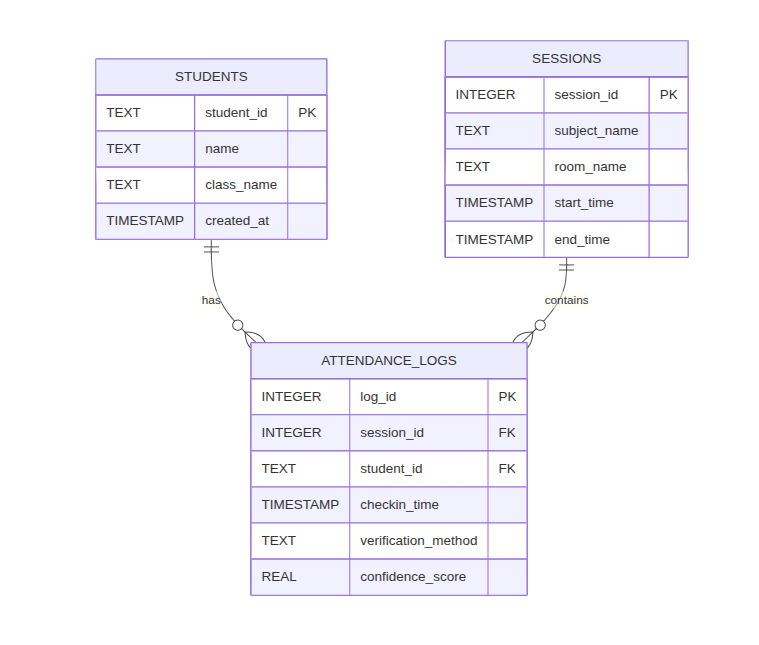

# KẾ HOẠCH TRIỂN KHAI & BÁO CÁO TIẾN ĐỘ DỰ ÁN
**Đề tài:** Hệ thống Điểm danh bằng Nhận diện Khuôn mặt (Face Recognition Attendance System)
---

### 1. Xác định tính năng của dụ án & Tìm hiểu về công nghệ sử dụng và setup cấu trúc thư mục cho dự án

### 1.1. Chức năng
1. Đầu vào là màn hình

2. Đăng ký mới sinh viên (id, họ tên, lớp)

3. Hình ảnh đầu vào (xử lý ảnh)

4. Quản lý sinh viên (danh sách sinh viên, có tìm kiếm, chỉnh sửa thông tin và xoá)

5. Nhận diện danh tính tự động (bấm vào có màn hình camera)

6. Nhận diện, xác định điểm danh bằng hình ảnh hay face

7. Xuất dữ liệu excel thống tin điểm danh

### 1.2. Xử lý
1.  **Kiến trúc Đa luồng (Multi-threading):** - Tách biệt luồng đọc Camera (IO-bound) và luồng xử lý AI (CPU-bound).
    - Sử dụng mô hình **Producer-Consumer** với `Queue` để giao diện không bao giờ bị đơ (Not Responding).
2.  **Giao diện Modal (Modal UI Logic):**
    - Cơ chế quản lý cửa sổ độc quyền: Chỉ cho phép một tác vụ (Đăng ký/Điểm danh/Quản lý) chạy tại một thời điểm để tối ưu tài nguyên phần cứng.
3.  **Bảo toàn dữ liệu (Data Integrity):**
    - Cơ chế **Rollback**: Tự động xóa dữ liệu rác nếu quá trình đăng ký khuôn mặt thất bại.
    - Cơ chế **Duplicate Check**: So sánh Vector đặc trưng để ngăn chặn đăng ký trùng lặp (1 người 2 ID).

### 1.3 Công nghệ sử dụng
- **Ngôn ngữ:** Python.
- **Core AI:** OpenCV, Face_recognition
- **Giao diện (GUI):** Tkinter
- **Cơ sở dữ liệu:** SQLite.
- **Thư viện khác:** dlib, numpy, pandas.

### 1.4 Database
1.  **Thiết kế schame:** 

Cơ sở dữ liệu của hệ thống điểm danh sinh viên được thiết kế nhằm phục vụ việc:
- Quản lý thông tin sinh viên
- Quản lý các phiên học (buổi điểm danh)
- Lưu trữ và truy xuất kết quả điểm danh

Hệ thống đảm bảo mỗi sinh viên chỉ được điểm danh **một lần trong mỗi phiên học**, đồng thời hỗ trợ cả hình thức điểm danh **tự động** và **thủ công**.

---

## 2. Danh sách các bảng

Cơ sở dữ liệu bao gồm ba bảng chính:

- `students` – Lưu thông tin sinh viên
- `sessions` – Lưu thông tin phiên học
- `attendance_logs` – Lưu nhật ký điểm danh

---

## 2.1 Bảng `students` – Sinh viên

### Mô tả
Bảng `students` dùng để lưu trữ thông tin cơ bản của sinh viên trong hệ thống.

### Cấu trúc bảng

| Tên cột | Kiểu dữ liệu | Mô tả |
|------|-------------|------|
| `student_id` | TEXT (PK) | Mã sinh viên |
| `name` | TEXT | Họ và tên sinh viên |
| `class_name` | TEXT | Lớp học |
| `created_at` | TIMESTAMP | Thời gian tạo bản ghi |

### Câu lệnh tạo bảng

```sql
CREATE TABLE IF NOT EXISTS students (
    student_id TEXT PRIMARY KEY,
    name TEXT NOT NULL,
    class_name TEXT NOT NULL,
    created_at TIMESTAMP DEFAULT CURRENT_TIMESTAMP
);
```

## 2.2 Bảng `sessions` – Phiên học / Buổi điểm danh

### Mô tả
Bảng `sessions` dùng để quản lý từng buổi học hoặc buổi điểm danh trong hệ thống.  
Mỗi phiên tương ứng với một lần mở camera để thực hiện nhận diện khuôn mặt sinh viên.

### Cấu trúc bảng

| Tên cột | Kiểu dữ liệu | Mô tả |
|--------|-------------|------|
| `session_id` | INTEGER (PK, AUTOINCREMENT) | Mã phiên học |
| `subject_name` | TEXT | Tên môn học |
| `room_name` | TEXT | Phòng học |
| `start_time` | TIMESTAMP | Thời gian bắt đầu mở camera |
| `end_time` | TIMESTAMP | Thời gian kết thúc phiên |

### Câu lệnh tạo bảng

```sql
CREATE TABLE IF NOT EXISTS sessions (
    session_id INTEGER PRIMARY KEY AUTOINCREMENT,
    subject_name TEXT NOT NULL,
    room_name TEXT,
    start_time TIMESTAMP DEFAULT CURRENT_TIMESTAMP,
    end_time TIMESTAMP
);
```

## 2.3 Bảng `attendance_logs` – Điểm danh

### Mô tả
Bảng `attendance_logs` dùng để lưu trữ kết quả điểm danh của sinh viên trong từng phiên học.  
Mỗi sinh viên chỉ được điểm danh một lần duy nhất trong một phiên học.

### Cấu trúc bảng

| Tên cột | Kiểu dữ liệu | Mô tả |
|--------|-------------|------|
| `log_id` | INTEGER (PK, AUTOINCREMENT) | Mã bản ghi điểm danh |
| `session_id` | INTEGER (FK) | Mã phiên học |
| `student_id` | TEXT (FK) | Mã sinh viên |
| `checkin_time` | TIMESTAMP | Thời gian điểm danh |
| `verification_method` | TEXT | Phương thức xác thực (`Auto`, `Manual`) |
| `confidence_score` | REAL | Điểm tin cậy do AI trả về |

### Câu lệnh tạo bảng

```sql
CREATE TABLE IF NOT EXISTS attendance_logs (
    log_id INTEGER PRIMARY KEY AUTOINCREMENT,
    session_id INTEGER NOT NULL,
    student_id TEXT NOT NULL,
    checkin_time TIMESTAMP DEFAULT CURRENT_TIMESTAMP,
    verification_method TEXT DEFAULT 'Auto',
    confidence_score REAL,
    FOREIGN KEY(session_id) REFERENCES sessions(session_id) ON DELETE CASCADE,
    FOREIGN KEY(student_id) REFERENCES students(student_id) ON DELETE CASCADE,
    UNIQUE(session_id, student_id)
);
```

### Hình ảnh ERD


[Xem ERD trên Mermaid Live](https://mermaid.live/view#pako:eNp9U21PgzAQ_ivkPuMCzrHJt8VVs-jQCCbGkJDa3kZ1tKYtRp377xZmpiLab9fnnrvn3jbAFEeIAfVM0JWmVS4999LsZkaSLPU2O7t5GbnNPGNrjtIWgntX5x1M0go7X2xNjSk6wHxB0my6uPKYRmqRF9Tu0G0uP9OTNJ1fJj_Sz5OMnJFrz6AxQsleBaa-f0Bmix4lWqnqTyHGUm0LK_pRlPwbthc5zTKSzKbJCSkuLs96ta7Vqquzp4zT87-b_AP7alyJ7FHIruKG-4xaLAWjtgleoS0V__K4JtMLjym5FC4-w8Iwpbtl7Uf__n5woDa_yoy9HEpqcuiM6h93l9FSIVsO-LDSgkO8pGuDPlSoK9rY0PYvB1uiKwoaHsclrde2oW0d74nKOzdFiK2uHVOrelXu49RP3O3S5xLvXdzoUJ-oWlqIw7ANAfEGXiAeRsHgeDgejsIgiqIgCo98eIV4NBoE0eHRJJyMw2E4jrY-vLU5g8FkPPIBubBKL3ZH097O9gMAOfZ9)


# 1. Mục tiêu công việc – Tuần 2

Dựa trên kế hoạch tổng thể, các đầu mục công việc đã thực hiện trong tuần này bao gồm:

- Thiết lập môi trường phát triển (Environment Setup)
- Xây dựng cấu trúc thư mục dự án (Project Structure / Base Code)
- Thiết kế và khởi tạo Cơ sở dữ liệu (Database Setup)
- Xây dựng các hàm tiền xử lý dữ liệu hình ảnh (Data Preprocessing)

---

# 2. Chi tiết thực hiện

## 2.1. Thiết lập môi trường phát triển

Đã tiến hành cài đặt các thư viện cần thiết dựa trên công nghệ gợi ý (OpenCV, dlib / face_recognition).

- **Ngôn ngữ**: Python 3.x  
- **Quản lý thư viện**: pip  

### File `requirements.txt`

```plaintext
opencv-python
numpy
face_recognition
pandas
openpyxl
cmake
dlib
```

---

## 2.2. Cấu trúc dự án (Project Structure)

```plaintext
FaceAttendanceSystem/
├── data/
│   ├── images/
│   └── database/
├── src/
│   ├── __init__.py
│   ├── config.py
│   ├── database.py
│   ├── face_utils.py
│   └── main.py
├── reports/
├── requirements.txt
└── README.md
```

---

## 2.3. Thiết kế Cơ sở dữ liệu (Database Design)

### Bảng `users`

| Tên cột | Kiểu dữ liệu | Mô tả |
|-------|------------|------|
| `id` | INTEGER (PK, AUTOINCREMENT) | ID nội bộ |
| `user_id` | TEXT (UNIQUE) | Mã sinh viên |
| `name` | TEXT | Họ tên |
| `face_encoding` | BLOB | Vector khuôn mặt |
| `created_at` | TIMESTAMP | Thời gian tạo |

```sql
CREATE TABLE IF NOT EXISTS users (
    id INTEGER PRIMARY KEY AUTOINCREMENT,
    user_id TEXT UNIQUE,
    name TEXT,
    face_encoding BLOB,
    created_at TIMESTAMP
);
```

---

# 3. Kết quả & Khó khăn

## Kết quả

- [x] Hoàn thành khung dự án
- [x] Tạo CSDL attendance.db
- [x] Mã hóa khuôn mặt thành công