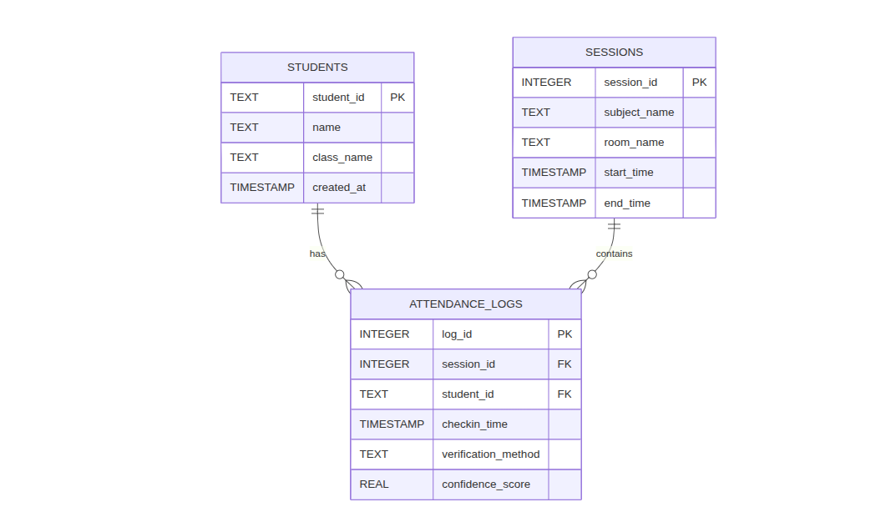

# KẾ HOẠCH TRIỂN KHAI & BÁO CÁO TIẾN ĐỘ DỰ ÁN
**Đề tài:** Hệ thống Điểm danh bằng Nhận diện Khuôn mặt (Face Recognition Attendance System)
---

### 1. Xác định tính năng của dụ án & Tìm hiểu về công nghệ sử dụng và setup cấu trúc thư mục cho dự án

### 1. Đăng ký mới (Register)

- Nhập MSSV, họ tên, lớp.
- Bật camera, chụp ảnh khuôn mặt.
- `FaceEncoder`: detect face → encode 128-D → lưu vào `face_encodings.pkl` (encodings + ids).
- Ghi thông tin sinh viên vào bảng `students` (db_manager).

### 2. Quản lý sinh viên

- Xem, thêm, sửa, xóa sinh viên (bảng `students`).
- Xuất báo cáo điểm danh ra Excel (từ `attendance_logs` + sessions).

### 3. Điểm danh Realtime

- Mở camera, load `face_encodings.pkl` (encodings, ids).
- Tạo phiên mới (`sessions`), khởi tạo `OptimizedAttendanceSystem` (realtime_engine).
- Luồng xử lý:
  - **Capture:** đọc frame từ camera, ghi vào `SharedFrameBuffer`.
  - **AI thread:** lấy frame từ buffer → resize 0.4x → `face_locations` (HOG) → `face_encodings` → so khớp với known_encodings (tolerance 0.45) → với mỗi face: `RealtimeAntiSpoof.check(face_roi, person_id)`.
  - Người đã điểm danh trong phiên (`checked_in`) được bỏ qua antispoof và không ghi DB lại.
  - Nếu nhận diện được + anti-spoof pass (`is_real`) và chưa trong `checked_in`: gọi `db.mark_attendance(session_id, student_id, ...)` với confidence_score, liveness_score, liveness_details; thêm vào `checked_in`.
- Hiển thị: khung **xanh** (đã điểm danh / người thật), khung **đỏ** (chưa nhận diện / không phải người thật). FPS và số người đã điểm danh hiển thị trên giao diện.

---

## Logic xử lý chính

### Nhận diện khuôn mặt

1. Frame resize 0.4x → `face_recognition.face_locations(rgb, model='hog')`.
2. `face_recognition.face_encodings(rgb, face_locations)` → 128-D mỗi mặt.
3. So khớp: `compare_faces` + `face_distance` với `known_encodings`, tolerance 0.45 → `person_id`, confidence.

### Chống giả mạo (Anti-spoof)

- Mỗi mặt có state riêng theo `person_id` (blink_count, movement_detected, ear_history, head_positions).
- **Khi có MediaPipe:**
  - **Chớp mắt:** EAR (Eye Aspect Ratio) từ Face Mesh; EAR < 0.25 coi là đóng, trước đó > 0.27 là mở; debounce 0.35s → tăng `blink_count`.
  - **Cử động đầu:** theo dõi vị trí mũi (landmark 1); movement > 0.04 → `movement_detected = True`.
  - **Texture:** Sobel gradient + variance theo block 16×16 (real face nhiều biến thiên, ảnh/màn hình mịn) → texture_score ≥ 0.42.
  - **Blur:** Laplacian variance → blur_score ≥ 0.28.
  - **Nghi màn hình:** tỉ lệ pixel rất sáng (V>245) hoặc độ sáng quá đều → ép texture xuống, reject.
  - **Kết luận:** `is_real` = (blink ≥ 1 hoặc movement_detected) và texture_ok và blur_ok và không screen_like.
- **Khi không có MediaPipe:** chỉ texture + blur + screen_like (ngưỡng chặt hơn, xem `_check_texture_only`).

Chi tiết đầy đủ: [docs/RECOGNITION_AND_ANTISPOOF.md](docs/RECOGNITION_AND_ANTISPOOF.md).

### 1.3 Công nghệ sử dụng
- **Ngôn ngữ:** Python.
- **Core AI:** OpenCV, Face_recognition
- **Giao diện (GUI):** Tkinter
- **Cơ sở dữ liệu:** SQLite.
- **Thư viện khác:** dlib, numpy, pandas.

### 1.4 Database
1.  **Thiết kế schame:** 

Cơ sở dữ liệu của hệ thống điểm danh sinh viên được thiết kế nhằm phục vụ việc:
- Quản lý thông tin sinh viên
- Quản lý các phiên học (buổi điểm danh)
- Lưu trữ và truy xuất kết quả điểm danh

Hệ thống đảm bảo mỗi sinh viên chỉ được điểm danh **một lần trong mỗi phiên học**, đồng thời hỗ trợ cả hình thức điểm danh **tự động** và **thủ công**.

---

## 2. Danh sách các bảng

Cơ sở dữ liệu bao gồm ba bảng chính:

- `students` – Lưu thông tin sinh viên
- `sessions` – Lưu thông tin phiên học
- `attendance_logs` – Lưu nhật ký điểm danh

---

## 2.1 Bảng `students` – Sinh viên

### Mô tả
Bảng `students` dùng để lưu trữ thông tin cơ bản của sinh viên trong hệ thống.

### Cấu trúc bảng

| Tên cột | Kiểu dữ liệu | Mô tả |
|------|-------------|------|
| `student_id` | TEXT (PK) | Mã sinh viên |
| `name` | TEXT | Họ và tên sinh viên |
| `class_name` | TEXT | Lớp học |
| `created_at` | TIMESTAMP | Thời gian tạo bản ghi |

### Câu lệnh tạo bảng

```sql
CREATE TABLE IF NOT EXISTS students (
    student_id TEXT PRIMARY KEY,
    name TEXT NOT NULL,
    class_name TEXT NOT NULL,
    created_at TIMESTAMP DEFAULT CURRENT_TIMESTAMP
);
```

## 2.2 Bảng `sessions` – Phiên học / Buổi điểm danh

### Mô tả
Bảng `sessions` dùng để quản lý từng buổi học hoặc buổi điểm danh trong hệ thống.  
Mỗi phiên tương ứng với một lần mở camera để thực hiện nhận diện khuôn mặt sinh viên.

### Cấu trúc bảng

| Tên cột | Kiểu dữ liệu | Mô tả |
|--------|-------------|------|
| `session_id` | INTEGER (PK, AUTOINCREMENT) | Mã phiên học |
| `subject_name` | TEXT | Tên môn học |
| `room_name` | TEXT | Phòng học |
| `start_time` | TIMESTAMP | Thời gian bắt đầu mở camera |
| `end_time` | TIMESTAMP | Thời gian kết thúc phiên |

### Câu lệnh tạo bảng

```sql
CREATE TABLE IF NOT EXISTS sessions (
    session_id INTEGER PRIMARY KEY AUTOINCREMENT,
    subject_name TEXT NOT NULL,
    room_name TEXT,
    start_time TIMESTAMP DEFAULT CURRENT_TIMESTAMP,
    end_time TIMESTAMP
);
```

## 2.3 Bảng `attendance_logs` – Điểm danh

### Mô tả
Bảng `attendance_logs` dùng để lưu trữ kết quả điểm danh của sinh viên trong từng phiên học.  
Mỗi sinh viên chỉ được điểm danh một lần duy nhất trong một phiên học.

### Cấu trúc bảng

| Tên cột | Kiểu dữ liệu | Mô tả |
|--------|-------------|------|
| `log_id` | INTEGER (PK, AUTOINCREMENT) | Mã bản ghi điểm danh |
| `session_id` | INTEGER (FK) | Mã phiên học |
| `student_id` | TEXT (FK) | Mã sinh viên |
| `checkin_time` | TIMESTAMP | Thời gian điểm danh |
| `verification_method` | TEXT | Phương thức xác thực (`Auto`, `Manual`) |
| `confidence_score` | REAL | Điểm tin cậy do AI trả về |

### Câu lệnh tạo bảng

```sql
CREATE TABLE IF NOT EXISTS attendance_logs (
    log_id INTEGER PRIMARY KEY AUTOINCREMENT,
    session_id INTEGER NOT NULL,
    student_id TEXT NOT NULL,
    checkin_time TIMESTAMP DEFAULT CURRENT_TIMESTAMP,
    verification_method TEXT DEFAULT 'Auto',
    confidence_score REAL,
    FOREIGN KEY(session_id) REFERENCES sessions(session_id) ON DELETE CASCADE,
    FOREIGN KEY(student_id) REFERENCES students(student_id) ON DELETE CASCADE,
    UNIQUE(session_id, student_id)
);
```

### Hình ảnh ERD


[Xem ERD trên Mermaid Live](https://mermaid.live/view#pako:eNp9U21PgzAQ_ivkPuMCzrHJt8VVs-jQCCbGkJDa3kZ1tKYtRp377xZmpiLab9fnnrvn3jbAFEeIAfVM0JWmVS4999LsZkaSLPU2O7t5GbnNPGNrjtIWgntX5x1M0go7X2xNjSk6wHxB0my6uPKYRmqRF9Tu0G0uP9OTNJ1fJj_Sz5OMnJFrz6AxQsleBaa-f0Bmix4lWqnqTyHGUm0LK_pRlPwbthc5zTKSzKbJCSkuLs96ta7Vqquzp4zT87-b_AP7alyJ7FHIruKG-4xaLAWjtgleoS0V__K4JtMLjym5FC4-w8Iwpbtl7Uf__n5woDa_yoy9HEpqcuiM6h93l9FSIVsO-LDSgkO8pGuDPlSoK9rY0PYvB1uiKwoaHsclrde2oW0d74nKOzdFiK2uHVOrelXu49RP3O3S5xLvXdzoUJ-oWlqIw7ANAfEGXiAeRsHgeDgejsIgiqIgCo98eIV4NBoE0eHRJJyMw2E4jrY-vLU5g8FkPPIBubBKL3ZH097O9gMAOfZ9)


# Tuần 2

# 1. Mục tiêu công việc 

Dựa trên kế hoạch tổng thể, các đầu mục công việc đã thực hiện trong tuần này bao gồm:

- Thiết lập môi trường phát triển (Environment Setup)
- Xây dựng cấu trúc thư mục dự án (Project Structure / Base Code)
- Thiết kế và khởi tạo Cơ sở dữ liệu (Database Setup)
- Xây dựng các hàm tiền xử lý dữ liệu hình ảnh (Data Preprocessing)

---

# 2. Chi tiết thực hiện

## 2.1. Thiết lập môi trường phát triển

Đã tiến hành cài đặt các thư viện cần thiết dựa trên công nghệ gợi ý (OpenCV, dlib / face_recognition).

- **Ngôn ngữ**: Python 3.x  
- **Quản lý thư viện**: pip  

### File `requirements.txt`

```plaintext
opencv-python
numpy
face_recognition
pandas
openpyxl
cmake
dlib
```

---

## 2.2. Cấu trúc dự án (Project Structure)

```
face_attendance_system/
├── app/
│   ├── config.py              # Đường dẫn, camera, tolerance, ngưỡng EAR...
│   ├── main.py                # Entry: menu chính (Đăng ký, Quản lý SV, Điểm danh)
│   └── gui/
│       ├── register_window.py       # Đăng ký sinh viên + chụp face, lưu encoding
│       ├── user_management_window.py # CRUD sinh viên, xem danh sách, xuất báo cáo
│       └── realtime_attendance.py   # Cửa sổ điểm danh realtime (camera, FPS, số đã điểm danh)
├── core/
│   ├── face_detector.py       # Phát hiện vùng mặt (face_recognition HOG)
│   ├── face_encoder.py        # Mã hóa face → 128-D, load/save pickle (encodings, ids)
│   ├── face_matcher.py        # So khớp encoding với known_encodings
│   └── realtime_engine.py     # Engine chính: nhận diện + anti-spoof + render, double buffer, thread xử lý
├── database/
│   ├── db_manager.py          # Kết nối SQLite, students, sessions, attendance_logs, cooldown, mark_attendance
│   └── schema.sql             # Định nghĩa bảng students, sessions, attendance_logs (có liveness_score, liveness_details)
├── utils/
│   ├── logger.py              # Setup logging
│   ├── image_utils.py         # cv2 → PIL/PhotoImage (hiển thị Tkinter)
│   └── video_stream.py        # VideoStream (thread đọc camera, queue 1 frame)
├── data/
│   ├── database/             # attendance.db
│   └── encodings/            # face_encodings.pkl (encodings + ids)
├── logs/                     # app.log
├── exports/                  # Báo cáo Excel xuất từ quản lý SV
├── docs/
│   └── RECOGNITION_AND_ANTISPOOF.md   # Chi tiết logic nhận diện và chống giả mạo
├── migrate_database.py       # Thêm cột liveness vào attendance_logs (nếu DB cũ)
├── run_realtime.py           # Chạy nhanh cửa sổ điểm danh realtime
├── requirements.txt
└── README.md
```

---

## 2.3. Thiết kế Cơ sở dữ liệu (Database Design)

### Bảng `users`

| Tên cột | Kiểu dữ liệu | Mô tả |
|-------|------------|------|
| `id` | INTEGER (PK, AUTOINCREMENT) | ID nội bộ |
| `user_id` | TEXT (UNIQUE) | Mã sinh viên |
| `name` | TEXT | Họ tên |
| `face_encoding` | BLOB | Vector khuôn mặt |
| `created_at` | TIMESTAMP | Thời gian tạo |

```sql
CREATE TABLE IF NOT EXISTS users (
    id INTEGER PRIMARY KEY AUTOINCREMENT,
    user_id TEXT UNIQUE,
    name TEXT,
    face_encoding BLOB,
    created_at TIMESTAMP
);
```

## Bảng `sessions` – Phiên học / Buổi điểm danh
 
### Cấu trúc bảng

| Tên cột | Kiểu dữ liệu | Mô tả |
|--------|-------------|------|
| `session_id` | INTEGER (PK, AUTOINCREMENT) | Mã phiên học |
| `subject_name` | TEXT | Tên môn học |
| `room_name` | TEXT | Phòng học |
| `start_time` | TIMESTAMP | Thời gian bắt đầu mở camera |
| `end_time` | TIMESTAMP | Thời gian kết thúc phiên |

### Câu lệnh tạo bảng

```sql
CREATE TABLE IF NOT EXISTS sessions (
    session_id INTEGER PRIMARY KEY AUTOINCREMENT,
    subject_name TEXT NOT NULL,
    room_name TEXT,
    start_time TIMESTAMP DEFAULT CURRENT_TIMESTAMP,
    end_time TIMESTAMP
);
```

## Bảng `attendance_logs` – Điểm danh

### Cấu trúc bảng

| Tên cột | Kiểu dữ liệu | Mô tả |
|--------|-------------|------|
| `log_id` | INTEGER (PK, AUTOINCREMENT) | Mã bản ghi điểm danh |
| `session_id` | INTEGER (FK) | Mã phiên học |
| `student_id` | TEXT (FK) | Mã sinh viên |
| `checkin_time` | TIMESTAMP | Thời gian điểm danh |
| `verification_method` | TEXT | Phương thức xác thực (`Auto`, `Manual`) |
| `confidence_score` | REAL | Điểm tin cậy do AI trả về |

### Câu lệnh tạo bảng

```sql
CREATE TABLE IF NOT EXISTS attendance_logs (
    log_id INTEGER PRIMARY KEY AUTOINCREMENT,
    session_id INTEGER NOT NULL,
    student_id TEXT NOT NULL,
    checkin_time TIMESTAMP DEFAULT CURRENT_TIMESTAMP,
    verification_method TEXT DEFAULT 'Auto',
    confidence_score REAL,
    FOREIGN KEY(session_id) REFERENCES sessions(session_id) ON DELETE CASCADE,
    FOREIGN KEY(student_id) REFERENCES students(student_id) ON DELETE CASCADE,
    UNIQUE(session_id, student_id)
);
```

---

# 3. Tiền xử lý dữ liệu (Data Preprocessing)

Đọc và chuẩn hóa ảnh:
Sử dụng cv2.imread để đọc ảnh đầu vào.
Chuyển đổi không gian màu từ BGR (OpenCV mặc định) sang RGB (yêu cầu của thư viện face_recognition).

Mã hóa khuôn mặt (Encoding):
Sử dụng thư viện face_recognition (dựa trên dlib) để trích xuất 128 đặc trưng (128-d embeddings) của khuôn mặt.
Xử lý ngoại lệ: Bỏ qua các ảnh không tìm thấy khuôn mặt hoặc có nhiều hơn 1 khuôn mặt.

# 4. Kết quả & Khó khăn

## Kết quả
- [x] Hoàn thành khung dự án
- [x] Tạo CSDL attendance.db
- [x] Mã hóa khuôn mặt thành công